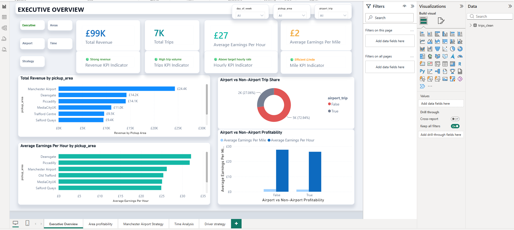
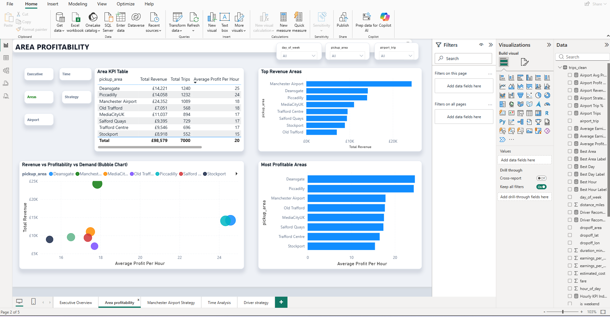
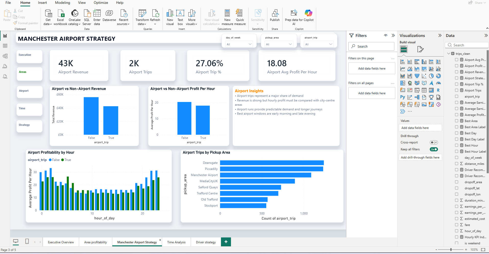
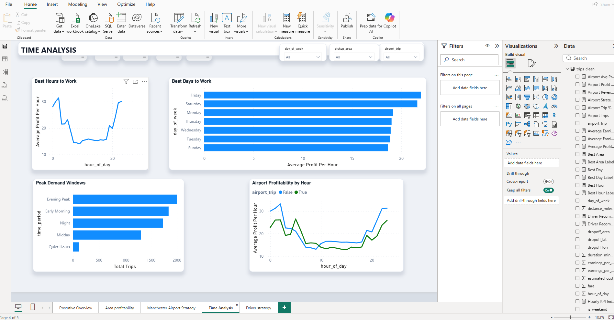
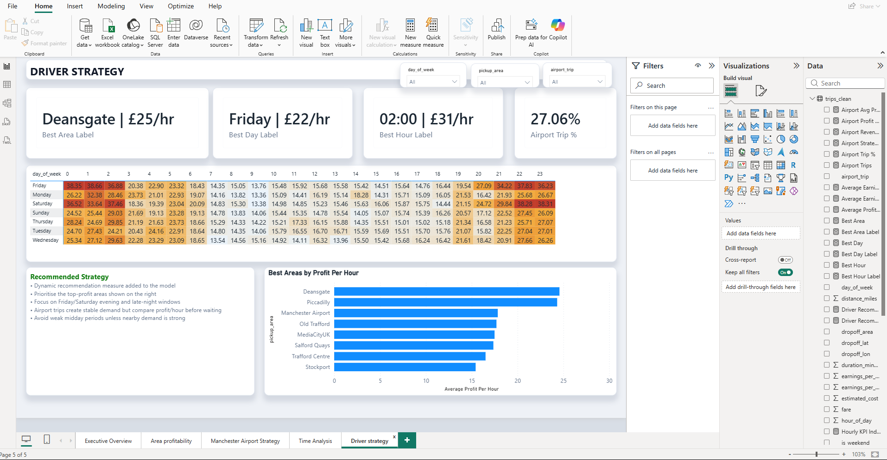

# Manchester Ride-Hailing Demand Analytics



A portfolio data analytics project analysing ride-hailing trip profitability across Greater Manchester using Python, SQL and Power BI.

---

## Business Problem

As a self-employed ride-hailing driver, profitability depends on more than simply being busy.

The key business question is:

> Which areas, times and trip types generate the highest earnings per hour?

This project analyses ride-hailing trip data based on real operational business questions, including airport-trip profitability, pickup-zone performance and revenue optimisation.

---

## Objectives

* Identify the most profitable pickup areas in Greater Manchester
* Compare airport and non-airport trip profitability
* Calculate earnings per hour and earnings per mile
* Build a repeatable ETL pipeline using Python
* Write SQL queries for business analysis
* Create an interactive profitability heatmap
* Design a Power BI dashboard for business decision-making

---

## Tech Stack

* Python
* Pandas
* SQL
* Power BI
* Folium
* Git
* GitHub

---

## Architecture

```text
Ride-Hailing Trip Data
        ↓
Python ETL (Pandas)
        ↓
Data Cleaning & Transformation
        ↓
SQL Analysis
        ↓
Power BI Dashboard
        ↓
Business Recommendations
```

---

## Power BI Dashboard

### Executive Overview


### Area Profitability



### Airport Strategy



### Time Analysis



### Driver Strategy



---

## Skills Demonstrated

### Data Analysis

* Exploratory Data Analysis (EDA)
* KPI Design
* Business Performance Analysis
* Revenue Optimisation

### SQL

* Aggregations
* Group By Analysis
* Window Functions
* Business Metrics
* Profitability Analysis

### Python

* Data Cleaning
* Data Transformation
* Feature Engineering
* ETL Pipelines
* Data Validation

### Power BI

* DAX Measures
* KPI Cards
* Conditional Formatting
* Heatmaps
* Interactive Dashboards
* Business Storytelling

### Business Intelligence

* Demand Analysis
* Revenue Analysis
* Operational Recommendations
* Driver Strategy Development

---

## Key Findings

* Deansgate generated the highest average earnings per hour (£25/hr)
* Airport trips represented approximately 27% of total demand
* Airport trips produced stable revenue but lower hourly profitability
* Friday and Saturday evenings were the most profitable periods
* The strongest driving strategy combined location, time and trip-type selection.
* Midday periods consistently generated the lowest earnings
* City-centre pickup areas outperformed suburban locations

---

## Recommendations

1. Prioritise Deansgate and Piccadilly pickups.
2. Focus on Friday and Saturday evening shifts.
3. Target late-night airport journeys when demand peaks.
4. Avoid low-profit midday periods where possible.
5. Use airport runs to stabilise revenue during quieter periods.
6. Focus on earnings-per-hour rather than total trip volume.

---

## Project Structure

```text
manchester-ride-hailing-analytics/

│
├── assets/
│   ├── executive_overview.png
│   ├── areas_profitability.png
│   ├── airport_strategy.png
│   ├── time_analysis.png
│   └── driver_strategy.png
│
├── dashboards/
│   └── Manchester_Ride_Hailing_Analytics.pbix
│
├── data/
│   ├── raw/
│   └── processed/
│
├── src/
│   ├── generate_sample_data.py
│   ├── clean_data.py
│   ├── analyze_profitability.py
│   └── create_heatmap.py
│
├── sql/
│   ├── create_tables.sql
│   ├── profitability_analysis.sql
│   └── airport_analysis.sql
│
├── maps/
│   └── manchester_profitability_heatmap.html
│
├── requirements.txt
├── .gitignore
└── README.md
```

---

## Running The Project

Install dependencies:

```bash
pip install -r requirements.txt
```

Generate sample data:

```bash
python src/generate_sample_data.py
```

Clean and transform data:

```bash
python src/clean_data.py
```

Run profitability analysis:

```bash
python src/analyze_profitability.py
```

Generate interactive map:

```bash
python src/create_heatmap.py
```

---

## Project Outcome

This project demonstrates a complete analytics workflow:

**Python → SQL → Power BI**

The dashboard transforms raw ride-hailing trip data into actionable operational recommendations for drivers seeking to maximise hourly earnings.

The project combines data engineering, analytics and business intelligence techniques to support data-driven decision-making.

---

## Future Improvements

* Replace flat-file storage with PostgreSQL
* Implement dimensional modelling (star schema)
* Automate ETL execution using Apache Airflow
* Introduce incremental data loading
* Add geospatial hotspot clustering
* Integrate weather and event datasets
* Build predictive demand forecasting models
* Deploy dashboard to Power BI Service
* Containerise the solution using Docker

```
```
